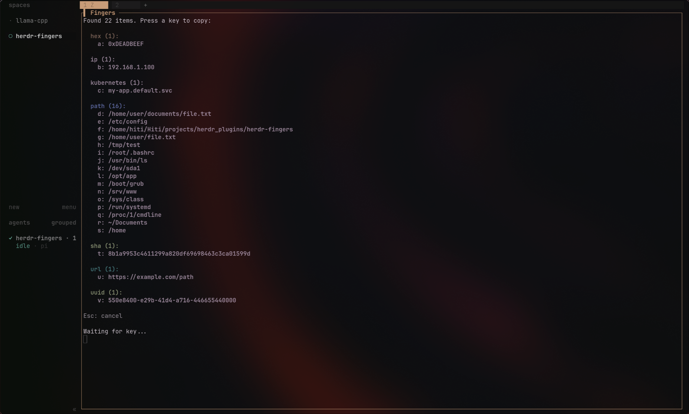

# herdr-fingers

Extract file paths, URLs, IPs, UUIDs, hashes, and other identifiers from the focused terminal pane and pick one with **vimium-style letter keys**.

Inspired by [tmux-fingers](https://github.com/Morantron/tmux-fingers).



## How it works

1. Press `alt+f` in any Herdr pane.
2. The plugin scans the **visible content** of the focused pane for 11 pattern types.
3. Each match gets a letter key (a–z, aa–az, etc.) and is displayed in a vimium-style overlay.
4. Press the corresponding key — the value is copied to your clipboard.
5. The overlay closes automatically.

Press `Esc` to cancel.

## Pattern types

| Type                | Example                                        |
| ------------------- | ---------------------------------------------- |
| `ip`                | `192.168.1.100`                                |
| `uuid`              | `550e8400-e29b-41d4-a716-446655440000`         |
| `sha`               | `8b1a9953c4611299a820df69698463c3ca01599d`     |
| `url`               | `https://example.com/path`                     |
| `path`              | `/home/user/documents/file.txt`, `/etc/config` |
| `hex`               | `0xDEADBEEF`                                   |
| `kubernetes`        | `my-app.default.svc.cluster.local`             |
| `git-status`        | `M src/main.py` (from `git status`)            |
| `git-status-branch` | `main` (from `git status` branch line)         |
| `digit`             | `12345678` (4+ digit numbers)                  |

## Installation

```bash
cd herdr-fingers
herdr plugin link .
```

Then bind a key of your choice in your `~/.config/herdr/config.toml`:

```toml
[[keys.command]]
key = "alt+f"  # change to whatever you like
```

Keep `type = "plugin_action"` and `command = "herdr-fingers.finger"` the same.

```toml
[[keys.command]]
key = "alt+f"
type = "plugin_action"
command = "herdr-fingers.finger"
description = "Fingers"
```

## Requirements

- Herdr ≥ 0.7.0
- Python 3.8+ (stdlib only — no pip packages needed beyond `rich`)
- One of: `wl-copy`, `xclip`, `xsel`, or `pbcopy` (for clipboard access)

## Limits

- Max **676 items** (26 single-letter + 650 two-letter keys)
- Items longer than 60 chars are truncated in the display (full value is still copied)
- Only extracts from the **currently focused pane's visible content**

## About

Written by me with some help from AI. Found a bug or have an idea? [Open an issue](../../issues).

## License

MIT
